# E-Commerce website project on a website that offers books and stationary items.

# Project Objective
The objective of this project is to design and develop a full‑stack E‑Commerce web application using the MERN stack that allows users to browse products, add them to a cart, securely authenticate, and complete payments using the Paytm payment gateway.

# Project Description
This project is a full‑stack E‑Commerce platform built using MongoDB, Express.js, React.js, and Node.js. The application provides user authentication using JWT, secure password storage using bcrypt, dynamic product listing, cart management, and online payment integration through Paytm. The system follows standard security practices and ensures a smooth user flow from signup/login to order confirmation.

# Project Flow:
Signup/Login → Home Page → Product Page → Add to Cart → Cart Page → Paytm Payment → Thank You Page

# Team Details
## Team Member 1 jahnavi172005@gmail.com 
              Name : Jahnavi Kashyap
              Roll no. : 25/WD-FWSD-A4/DEC-8528
## Team Member 2	priyatanu970@email.com
              Name : Tanu Priya
              Roll no. : 25/WD-FWSD-A4/DEC-8530
              
# Technologies Used
### Frontend
* **React.js**: For building a dynamic and responsive user interface.
* **HTML5 & CSS3**: For semantic structure and custom parchment-style styling.
* **JavaScript (ES6+)**: For frontend logic and API integration.
### Backend
* **Node.js**: As the server-side runtime environment.
* **Express.js**: For building the RESTful API and handling server routes.
* **MongoDB**: NoSQL database for storing user data, products, and orders.
* **Mongoose**: For elegant MongoDB object modeling.
### Authentication & Security
* **JWT (JSON Web Token)**: For secure, stateless user authentication.
* **bcrypt**: For hashing and securing user passwords in the database.
### Payment Gateway
* **Paytm**: Integrated for secure and seamless online transactions.
### Tools & Services
* **Git & GitHub**: For version control and repository management.
* **Postman**: Used for testing API endpoints during development.
* **VS Code**: The primary code editor.
* **Vercel**: For hosting the frontend.
* **Render**: For hosting the backend API.

# Folder Structure
```text
mern-ecommerce/
│
├── backend/
│ ├── config/
│ │ └── db.js
│ ├── controllers/
│ ├── models/
│ │ ├── User.js
│ │ ├── Product.js
│ │ └── Order.js
│ ├── routes/
│ ├── middleware/
│ └── server.js
│
├── frontend/
│ ├── src/
│ │ ├── components/
│ │ ├── pages/
│ │ ├── services/
│ │ └── App.js
│ └── package.json
│
└── README.md
```

# Features Implemented
1. **User Signup and Login System**: Complete authentication flow for new and returning users.
2. **Password Hashing**: Secure password storage using `bcrypt` to protect user data.
3. **JWT-based Authentication**: Secure access to protected routes using JSON Web Tokens.
4. **Product Listing**: Dynamic display of book and stationery items on the Home Page.
5. **Dynamic Routing**: Individual Product Details pages that fetch specific data based on item ID.
6. **Add to Cart Functionality**: Seamless addition of products to a virtual shopping cart.
7. **Cart Management**: Ability to increase, decrease, or remove items directly within the cart.
8. **Total Price Calculation**: Automated real-time calculation of the total order value.
9. **Data Persistence**: Cart data is stored using both `LocalStorage` and `MongoDB` for a consistent experience.
10. **Paytm Payment Integration**: Full integration with the Paytm gateway for secure online transactions.
11. **Secure Payment Verification**: Backend logic to verify successful transactions before processing orders.
12. **Order Tracking**: Creation of order records and real-time tracking of payment status.
13. **Order Confirmation**: A dedicated Thank You page to confirm successful purchases to the user.
14. **Additional Support Pages**: Dedicated Account management, About Us, Help, and Contact pages.

# Screenshots of the Project
## 1.Authentication & User Access
### i.Login Page: 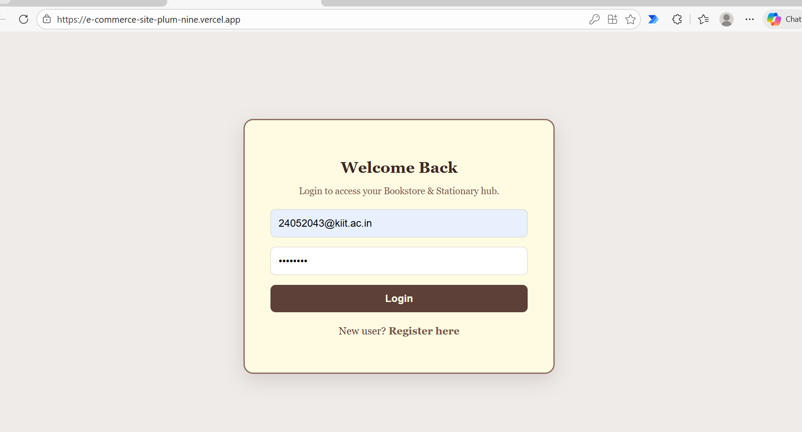

### ii.Signup Page: 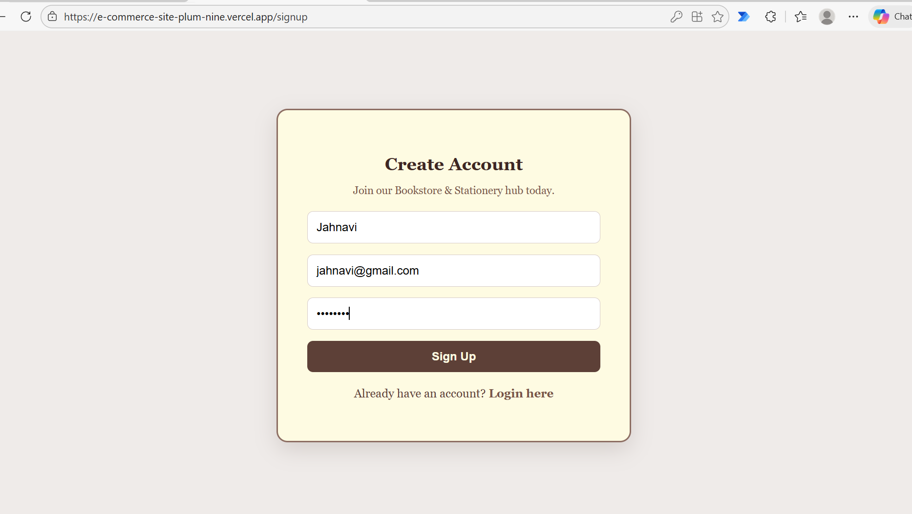

## 2.Browsing & Discovery
### i.Home Page: 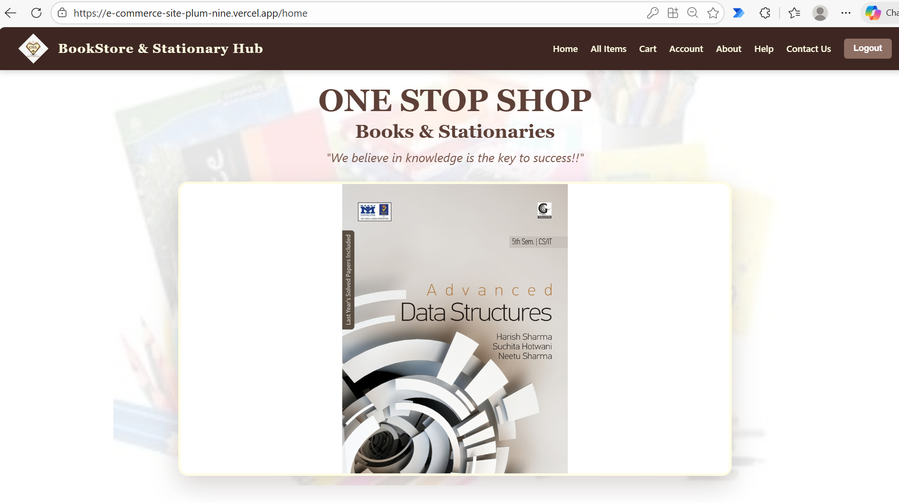

### ii.Product Listing (40 Items): 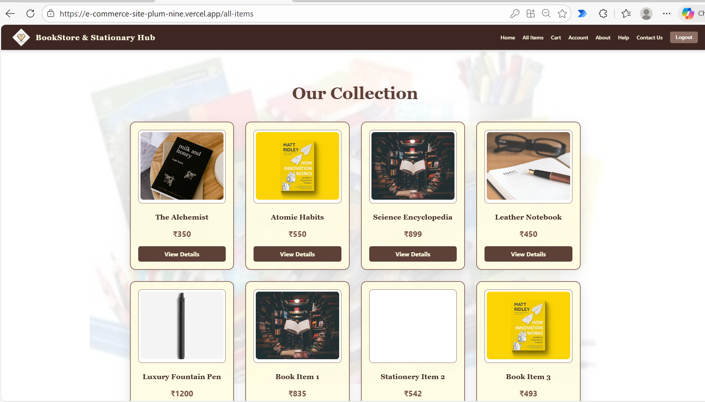

### iii.Product Details Page: 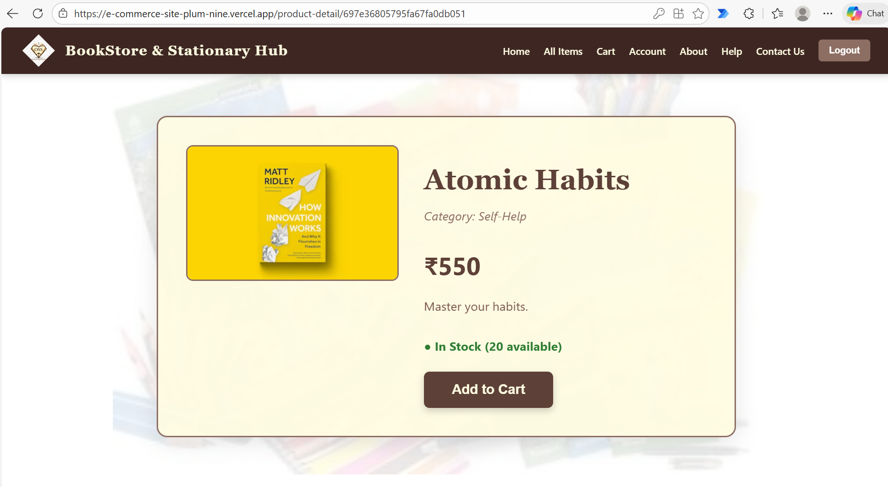

## 3.Shopping & Checkout
### i.Shopping Cart: 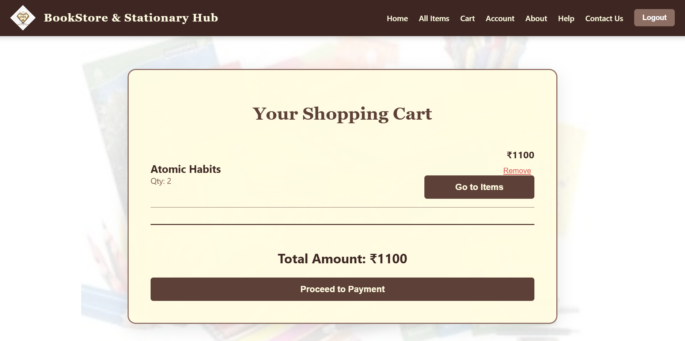

### ii.Payment Gateway: 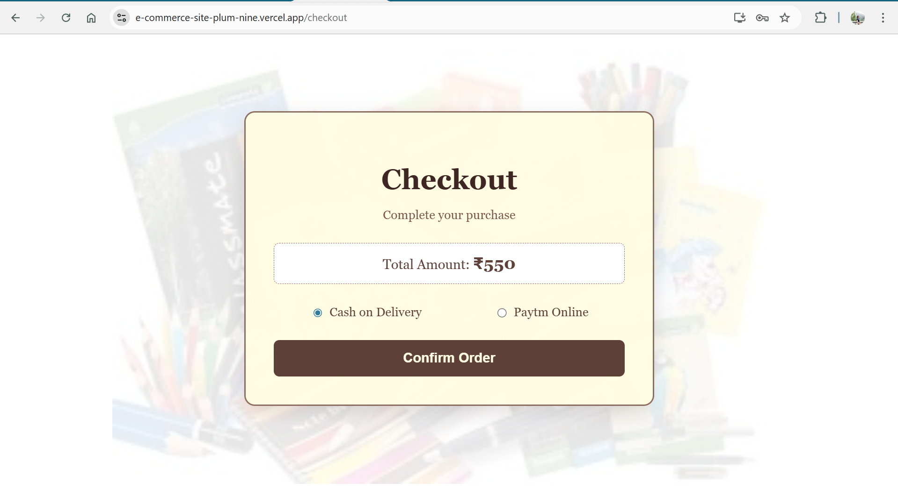

### iii.Paytm Payment Gateway: 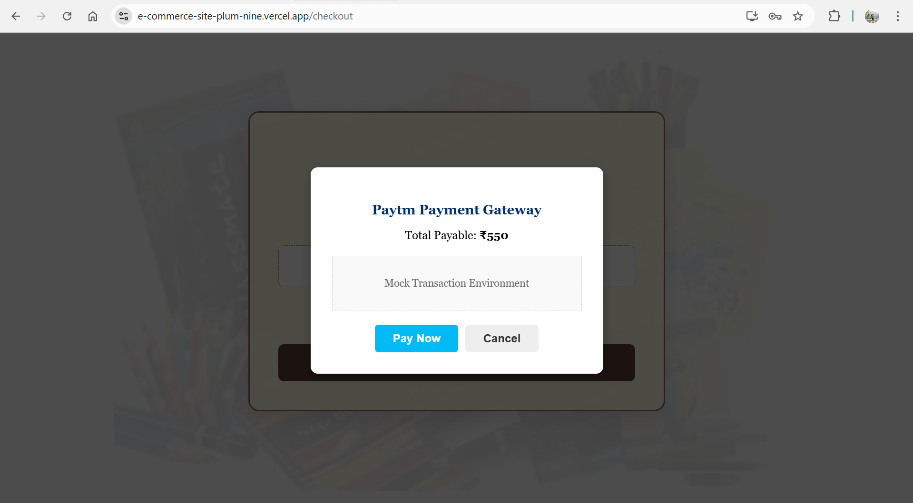

### iv.Thankyou: 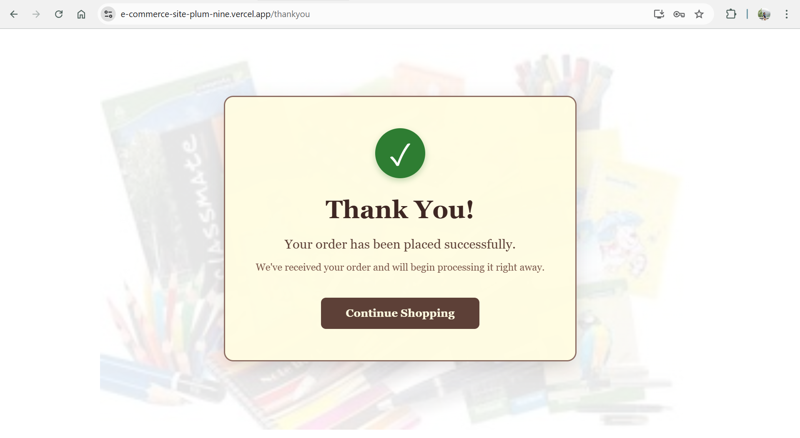

## 4.Account & Support Pages
### These pages ensure a complete user experience and easy navigation for help or contact.
### i.User Account Profile: 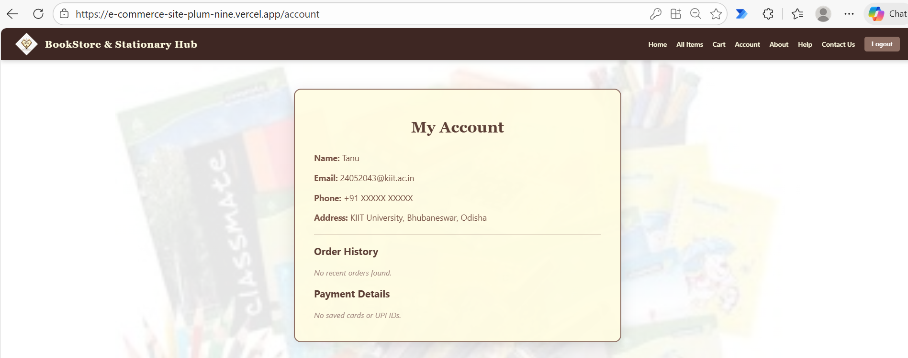

### ii.About Us (The Parchment Style Page): 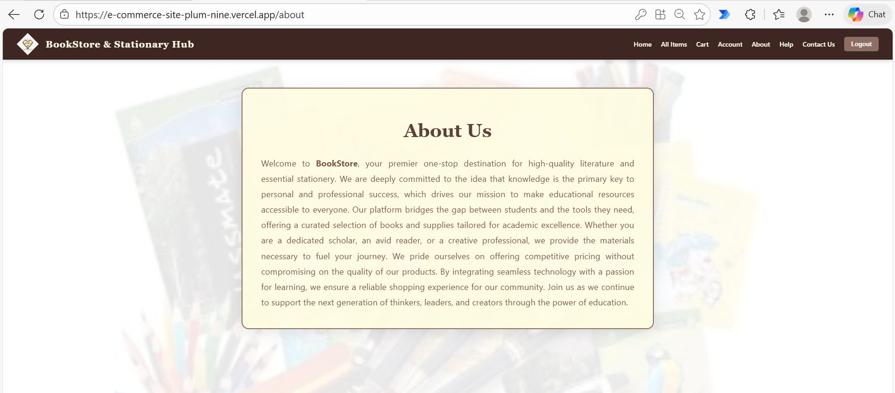

### iii.Contact Us: 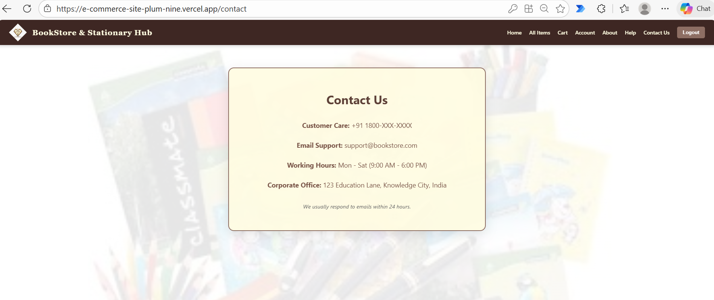

### iv.Help & FAQ: 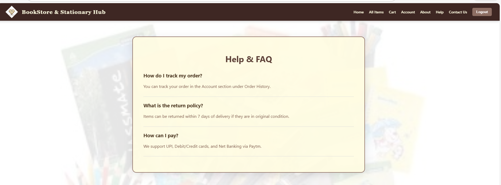

# Live Project Link
[E-Commerce Bookstore & Stationery](https://e-commerce-site-plum-nine.vercel.app)

# Challenges Faced
1. **Integrating Paytm Payment Gateway Securely**: Ensuring the checksum generation and verification logic between the backend and Paytm's servers was accurate to prevent fraudulent transactions.
2. **Handling JWT Authentication and Protected Routes**: Implementing middleware to verify JSON Web Tokens and ensuring that only authenticated users could access private pages like the Cart and Order History.
3. **Managing Cart State Efficiently**: Synchronizing the shopping cart between the local browser storage (LocalStorage) and the MongoDB database to ensure a consistent user experience across sessions.
4. **Backend and Frontend Integration**: Resolving Cross-Origin Resource Sharing (CORS) issues and ensuring the Vercel frontend correctly communicated with the Render backend using precise API endpoint routing.

# Conclusion
This MERN E‑Commerce project successfully demonstrates the implementation of a secure, scalable, and user‑friendly online shopping platform. The project helped in gaining practical experience with full‑stack development, authentication mechanisms, payment gateway integration, and real‑world application architecture.


